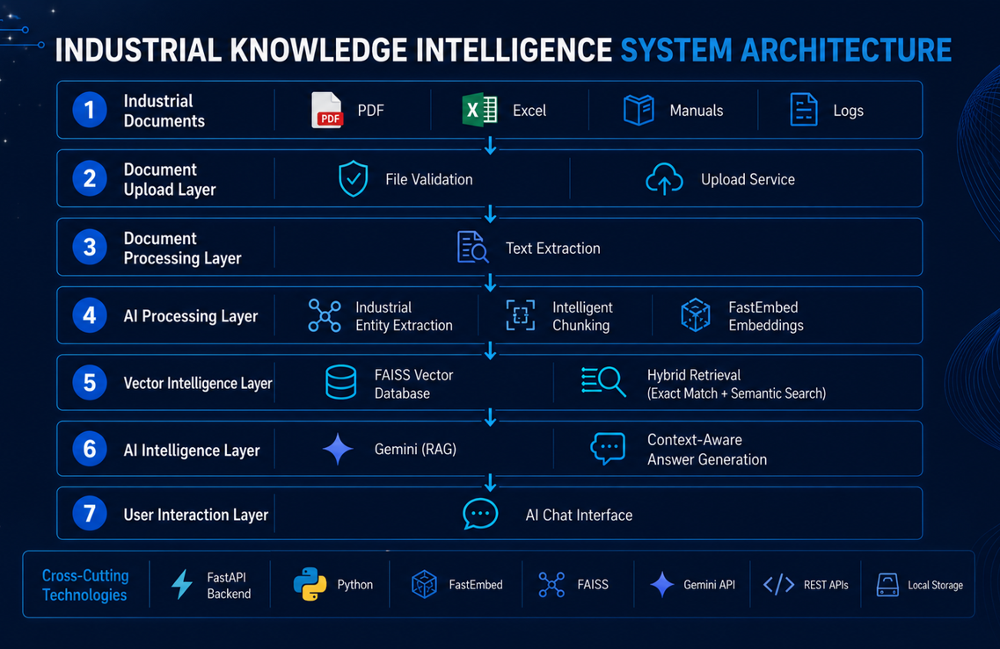
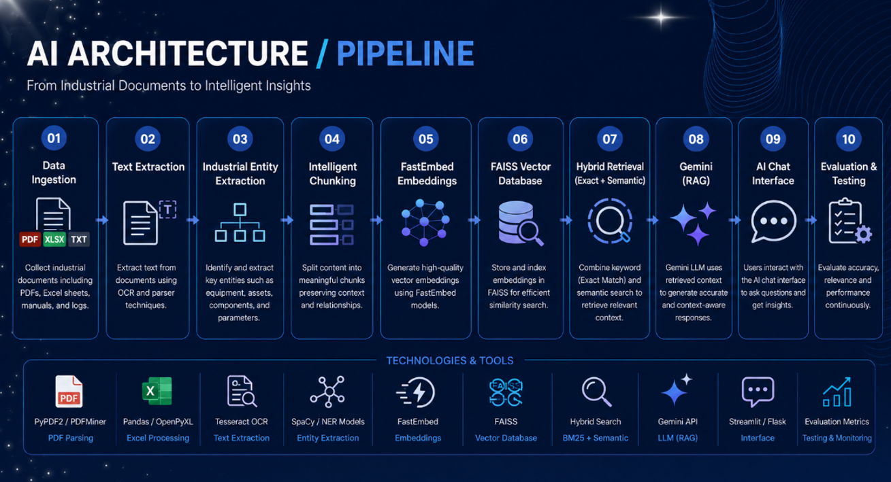
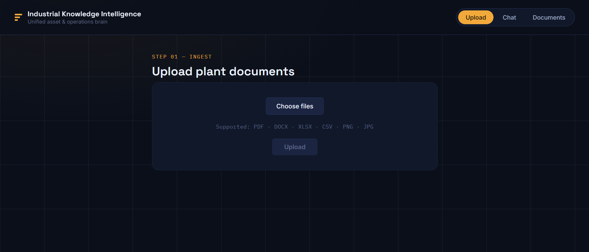
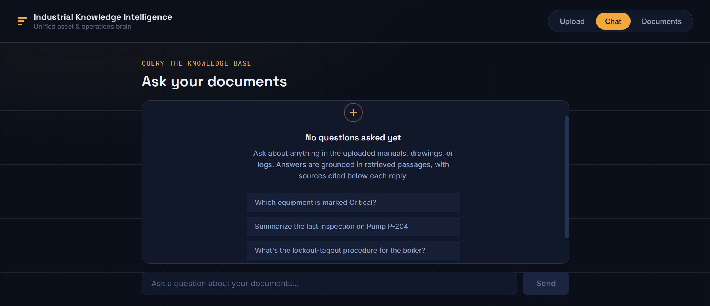
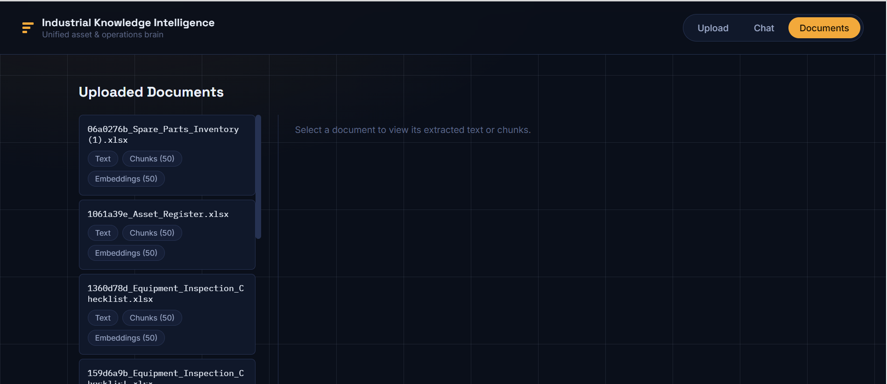

# 🏭 Industrial Knowledge Intelligence Platform

> 🚀 An AI-powered Retrieval-Augmented Generation (RAG) platform for intelligent industrial knowledge retrieval.

An AI-powered Retrieval-Augmented Generation (RAG) platform that enables engineers to retrieve accurate information from industrial manuals, maintenance logs, inspection reports, and operational documents using natural language queries.

The platform combines semantic search, hybrid retrieval, vector embeddings, and Google Gemini to deliver context-aware, source-grounded answers for industrial knowledge management.

---

# 📖 Project Description

Industrial Knowledge Intelligence Platform is designed to simplify access to technical documentation by allowing users to ask questions in natural language instead of manually searching through hundreds of pages of documents.

The system extracts information from uploaded industrial documents, identifies important industrial entities, converts the content into vector embeddings, and stores them in a FAISS vector database. When a user submits a query, the platform retrieves the most relevant document chunks and uses Google's Gemini model to generate accurate responses with supporting source citations.

---

# ✨ Features

- ✅ Multi-format document upload
- ✅ PDF, DOCX, XLSX & CSV support
- ✅ Intelligent text extraction
- ✅ Industrial entity extraction
- ✅ Context-aware document chunking
- ✅ FastEmbed vector embeddings
- ✅ FAISS Vector Database
- ✅ Hybrid Retrieval
- ✅ Cross-document Retrieval
- ✅ Gemini-powered AI responses
- ✅ Source Citations
- ✅ Compliance Intelligence

---

# 🏗️ Architecture

## System Architecture




## AI Architecture



---

# 🛠️ Tech Stack

## 🎨 Frontend
- React
- Vite

## ⚙️ Backend
- FastAPI
- Python

## 🤖 AI & Machine Learning
- Google Gemini
- FastEmbed
- Sentence Transformers

## 🗄️ Database
- FAISS Vector Database

## 📚 Libraries
- PyMuPDF
- Pandas
- NumPy

---

# 📂 Project Structure

```text
Industrial-Knowledge-Intelligence-Platform/
│
├── 📁 backend/
│   ├── 📁 chunks/
│   ├── 📁 embeddings_store/
│   ├── 📁 entities/
|   ├── 📁 extracted_text/
|   ├── 📁 indexes/
│   ├── 📄 main.py
│   ├── 📄 requirements.txt
│   └── ...
│
├── 📁 frontend/
│   ├── 📁 public/
│   ├── 📁 src/
│   ├── 📄 package.json
│   ├── 📄 vite.config.js
│   └── ...
│
├── 📁 images/
│   ├── System_Architecture
│   ├── AI_Architecture
│   ├── Upload_Section
|   ├── Chat_Section
|   └── Documents_Section
|      
│
├── 📄 README.md
└── 📄 .gitignore
```

---

# 🚀 Installation

## 📥 Clone the Repository

```bash
git clone https://github.com/MannayKrithika/ET-AI-Hackathon.git
```

```bash
cd ET-AI-Hackathon
```

---

## ⚙️ Backend Setup

```bash
cd backend
```

Create a virtual environment.

```bash
python -m venv venv
```

Activate it.

**Windows**

```bash
venv\Scripts\activate
```

Install dependencies.

```bash
pip install -r requirements.txt
```

Run the server.

```bash
uvicorn main:app --reload
```

🌐 Backend runs at:

```
http://localhost:8000
```

---

## 💻 Frontend Setup

```bash
cd frontend
```

Install dependencies.

```bash
npm install
```

Start the application.

```bash
npm run dev
```

🌐 Frontend runs at:

```
http://localhost:5173
```

---

# 🔄 Workflow

1. 📄 Upload industrial documents
2. 🔍 Extract text from supported file formats
3. 🏷️ Identify industrial entities
4. ✂️ Split documents into semantic chunks
5. 🧠 Generate vector embeddings using FastEmbed
6. 🗄️ Store embeddings in FAISS
7. 🎯 Retrieve relevant document chunks
8. 🤖 Generate responses using Google Gemini
9. 📚 Display source citations

---


## 🖼️ Screenshots









---

# 🔮 Future Scope

- 🌐 IoT Integration
- 🔧 Predictive Maintenance
- 👥 Role-Based Access Control (RBAC)
- 🎙️ Voice Assistant Integration

---

# 👨‍💻 Contributors

- 👤 Krithika Mannay
- 👤 Eda Gayathri

---

# 📜 License

Developed for the **🏆 Economic Times Hackathon 2026** for educational and demonstration purposes.